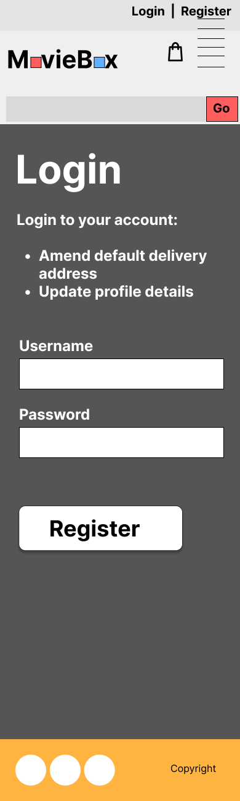
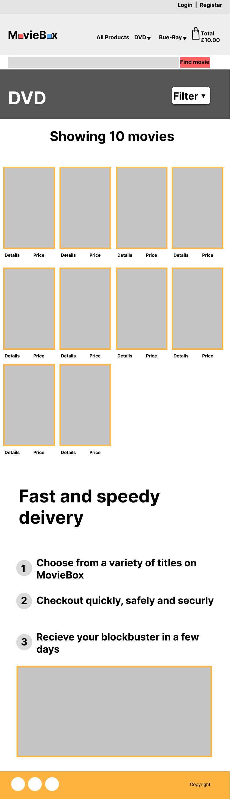

# MovieBox  
MovieBox is an online web ecommerce store application which specialises in past available titles which were released on DVD and Blue-Ray formats.  
MovieBox will clearly list and display titles using captive box art imagery and clear informative details surrounding the title to allow end users to make a clear and informative buying choices.  

[Live site preview link coming soon]()  

## Table of contents  
1. [Overview](#overview)  
2. [Design brief](#design-brief)  
3. [Research](#research)  
4. [Goals and Target audience](#goals-and-target-audience)  
    4.1 [Project goals](#project-goals)  
    4.2 [User goals](#user-goals)  
    4.3 [Site owners goals](#site-owners-goals)  
    4.4 [Target audience](#target-audience)  
5. [User Experience (UX)](#user-experience-ux)  
    [User stories](#user-stories)  
    5.1 [First time user](#first-time-user)  
    5.2 [Returning user](#returning-user)  
    5.3 [Site owner](#site-owner)  
6. [Design](#design)  
    6.1 [Structure of pages](#structure-of-pages)  
    - [Header section](#header-section)  
    - [Main content area](#main-content-area)  
    - [Shopping basket area](#shopping-basket-area)  
    - [Secondary main area](#secondary-main-area)  
    - [Footer section](#footer-section)   
    6.2 [Wireframes](#wireframes)  
    - [Homepage](#homepage)  
    - [Login page](#login-page)  
    - [Register page](#register-page)  
    - [Products page](#prodicts-page)  
    - [Product description page](#product-description-page)  
    - [Basket page](#basket-page)  
    - [Purchase page](#purchase-page)  

## Overview  
The MovieBox application is a database driven ecommerce web application which stores stock of physical media and helpfully categorises available media into an easy-to-understand front-end experience which can then be used by a wide range of audiences and potential customers.  
The business purpose of MovieBox is to provide a varied selection of past and present DVD and Blue-Ray media titles to its audience in a clear and usable ecommerce web application to generate revenue to support the repurchasing of new and used titles for its platform.  
The sites expected audience will be to anyone looking to purchase a small to large selection of media titles, the sites audience would be any user who wishes to buy media from an online store through their desktop or mobile device.  
The application will provide to new users a reassurance and positive feeling by providing a simple intrusive interface which is clean and simple to use, the applications purpose is maintained throughout its interface and will help guide its customers through to completed order by providing clear informative information about a tile whilst browsing the web application and though its ordering and payment system.  

## Design brief  
Plan, design and build a data driven ecommerce web application for potential customers who wish to purchase present and past DVD and Blue-Ray movies titles with a consistent and approachable user interface.  
The application will provide a safe and secure online shopping experience with a secure payment gateway using integration with industry leading payment system Stripe.  
The application will use external resources to inform the end user about interesting information relating to their possible media order.  
The application will allow for easier processing of future orders by allowing a user to securely save previously entered order details required for future checkout interactions.  

## Research  
Please view the [research](docs/research/RESEARCH.md) document for details of user research carried out through the planning phase for MovieBox.  

## Goals and Target audience  
### Project goals  
- The project will provide an online web e-commerce store where anyone interested in purchasing physical media will be able to do so using an easy-to-understand interface.  
- The e-commerce web store will provide users with information about a product before purchasing.  
- The project will enable users to purchase items through a integrated payment system and receive confirmation of their purchase.  
- The e-commerce web application will be viewable and usable using any browser on any device.  

### User goals  
- Find information about what MovieBox is all about.  
- Find information about products available on MovieBox.  
- Easily register and login to enable streamlined future purchases.  
- Find information about what they have within their checkout basket.  
- View their completed orders and delivery information.  

### Site owner goals  
- The MovieBox site owner would like to promote the easy to understand and use approach of the e-commerce web application.  
- It is also important that users can see their current and previous purchases.  
- Build trust with its users so recommendations help grow the e-commerce stores visits as a useful supplier of DVD and Blue-Ray media.  

### Target audience  
- The e-commerce store will be able to be usable by all ages.
- Those looking for an e-commerce store offering a selection of new and used DVD and Blue-Ray movies.  
- Movie enthusiasts who want to discover information about a movie whilst also being able to purchase from a reputable online store.  
- Charities or small establishments wising to make contact and sell through the store.  

## User Experience (UX)  
During project planning, it was set out that the user interface should be easily understood to provide an overall good user experience and provide a positive feeling when navigating and interacting with the e-commerce web application.  
Because the application is aimed at varied ages, logical placement of buttons, links and form fields will all be clearly tagged to ensure no barriers are present or experienced whilst a user is using the e-commerce web application.  
Keyboard and screen reader navigation has also been considered and all elements will be reachable using a keyboard alone to ensure the e-commerce store is as accessible as possible to all users of the web application.  

### User stories  
#### First time user  
- As a first-time user, I want to understand what the applications purpose is so that I can decide if it meets my needs.  
- As a first-time user, I want to be able to easily navigate to the various categories of products.  
- As a first-time user, I want to be able to add a movie to my shopping basket.  
- As a first-time user, I want to be able to easily view the items in my shopping basket.  
- As a first-time user, I want to find out more information about a movie product.  
- As a first-time user, I want to find out how much a product costs.  
- As a first-time user, I want to know how to proceed to the checkout section so I can purchase an item.  

#### Returning user  
- As a returning user, I want to be able to easily navigate to the account login page.  
- As a returning user, I want to be able to see a previous order I have made.  
- As a returning user, I want to be able to see how many movies are in my shopping basket.  
- As a returning user, I want to be able to view items based on a filter I select.  
- As a returning user, I want to be able to change the type of a media item.  
- As a returning user, I want to be able to update my account delivery details.  

#### Site owner  
- As the site owner, I want visitors to be able to find the correct information about a product and make an informed choice to purchase.  
- As the site owner, I want visitors to be able to find the correct information about a product and make an informed choice to purchase.  
- As the site owner, I want visitors to be able to easily add their movie choices to their shopping basket for purchase.  
- As the site owner, I want the site visitors to be able to see what they have previously bought.  
- As the site owner, I want to encourage users to visit clearance and sale areas.  

## Design  
MovieBox was designed to be clean, clear and easily understood by all audiences using the e-commerce web application, header and footer sections persist throughout the web application to ensure navigation is kept consistent, easy to navigate and provides a pleasant user experience (UX) throughout.  
The e-commerce web application uses mainly solid colours which contrast each other well, for example a darker grey against orange gives the feeling of hard edges to reflect DVD, Blue-Ray boxes and the boxy appearance of a store front.  
As a person with a visual impairment, the e-commerce web application has been designed with screen magnification and screen readers in mind.  

### Structure of pages  
The website application uses a mobile first approach with the page having a maximum width of 1320px at retina resolutions or a 1140px for most standard displays which centre aligns at higher resolutions. These constraints were used to maintain the user’s focus, attention and aid with sight lines.  

#### Header section  
The application follows a universal approach which comprises of a left aligned logo for Mobile through to Desktop.  
To the right is the applications main navigation, which is responsive, and full text links remain right aligned until tablet size and below where it will collapse to a right aligned Hamburger menu (toggle button).  
On devices tablet and below the user will be able to expand/collapse this menu using the menu toggle button to access all available menu items dependant on their logged in status.  

#### Main content area  

#### Shopping basket area  

#### Secondary main area  

#### Footer section  

### Wireframes  
Wireframe designs show Mobile, Tablet and Desktop views of the main concept  parts of the MovieBox e-commerce web application.  
The application follows best practices and was developed using a mobile first approach to ensur the application was accessible to a wide audience.  

#### Homepage  

Mobile
  

   

Tablet
  

  

Desktop
  

  

#### Login page  

Mobile
  

   

Tablet
  

  

Desktop
  

   

#### Register page  

Mobile
  

   

Tablet
  

  

Desktop
  

   

#### Prodicts page  

Mobile
  

   

Tablet
  

  

Desktop
  

  

#### Product description page  

Mobile
  

   

Tablet
  

  

Desktop
  

  

#### Basket page  

   

Tablet
  

  

Desktop
  

   

#### Purchase page  

Mobile
 

   

Tablet
  

  

Desktop
  

  
