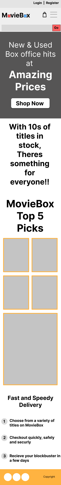
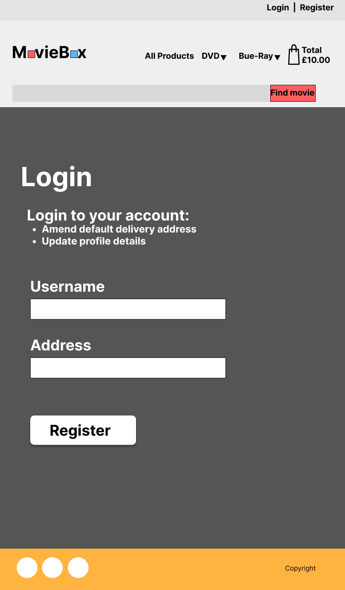
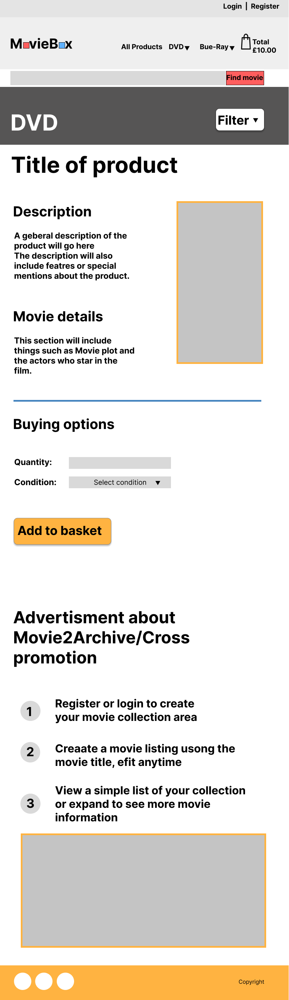

# MovieBox  
MovieBox is an online web ecommerce store application which specialises in past available titles which were released on DVD and Blue-Ray formats.  
MovieBox will clearly list and display titles using captive box art imagery and clear informative details surrounding the title to allow end users to make a clear and informative buying choices.  

[Live site preview link coming soon]()  

## Table of contents  
1. [Overview](#overview)  
2. [Design brief](#design-brief)  
3. [Research](#research)  
4. [Goals and Target audience](#goals-and-target-audience)  
    4.1 [Project goals](#project-goals)  
    4.2 [User goals](#user-goals)  
    4.3 [Site owners goals](#site-owners-goals)  
    4.4 [Target audience](#target-audience)  
5. [User Experience (UX)](#user-experience-ux)  
    [User stories](#user-stories)  
    5.1 [First time user](#first-time-user)  
    5.2 [Returning user](#returning-user)  
    5.3 [Site owner](#site-owner)  
6. [Design](#design)  
    6.1 [Structure of pages](#structure-of-pages)  
    - [Header section](#header-section)  
        - [Account bar section](#account-bar-section)  
        - [Main navigation bar section](#main-navigation-bar-section)  
        - [Search area section](#search-area-section)  
    - [Main content area](#main-content-area)  
        - [Main top hero section](#main-top-hero-section)  
        - [Homepage](#homepage)  
        - [Secondary main area](#secondary-main-area)  
    - [Footer section](#footer-section)   
    - [Overview of sections](#overview-of-sections)  

    6.2 [Wireframes](#wireframes)  
    - [Homepage](#homepage-1)  
    - [Login page](#login-page)  
    - [Register page](#register-page)  
    - [Products page](#prodicts-page)  
    - [Product description page](#product-description-page)  
    - [Basket page](#basket-page)  
    - [Purchase page](#purchase-page)  

    6.3 [Colours](#colours)  
    - [Colour palette](#colour-palette)  
    - [Contrast grid](#contrast-grid)  

    6.4 [Typography](#typography)  
    6.5 [Icons and imagery](#icons-and-imagery)  
7. [Database and Sitemaps](#database-and-sitemaps)  
    7.1 [Overview of apps](#overview-of-apps)  
    7.2 [Product data files](#product-data-files)  
    7.3 [Sitemap diagrams](#sitemap-diagrams)  
8. [Existing features and future implimentations]()  
    8.1 [Existing features](#existing-features)  
    8.2[Features to be implimented in future releases](#features-to-be-implimented-in-future-releases)  
9. [Testing](#testing)    
10. [Technologies used](#technologies-used)  
    10.1 [Languages](#languages)  
    10.2 [Databases](#databases)  
    10.3 [Frameworks and libraries](#frameworks-and-libraries)  
    10.4 [Programs and online resources](#programs-and-online-resources)  

## Overview  
The MovieBox application is a database driven ecommerce web application which stores stock of physical media and helpfully categorises available media into an easy-to-understand front-end experience which can then be used by a wide range of audiences and potential customers.  
The business purpose of MovieBox is to provide a varied selection of past and present DVD and Blue-Ray media titles to its audience in a clear and usable ecommerce web application to generate revenue to support the repurchasing of new and used titles for its platform.  
The sites expected audience will be to anyone looking to purchase a small to large selection of media titles, the sites audience would be any user who wishes to buy media from an online store through their desktop or mobile device.  
The application will provide to new users a reassurance and positive feeling by providing a simple intrusive interface which is clean and simple to use, the applications purpose is maintained throughout its interface and will help guide its customers through to completed order by providing clear informative information about a tile whilst browsing the web application and though its ordering and payment system.  

## Design brief  
Plan, design and build a data driven ecommerce web application for potential customers who wish to purchase present and past DVD and Blue-Ray movies titles with a consistent and approachable user interface.  
The application will provide a safe and secure online shopping experience with a secure payment gateway using integration with industry leading payment system Stripe.  
The application will use external resources to inform the end user about interesting information relating to their possible media order.  
The application will allow for easier processing of future orders by allowing a user to securely save previously entered order details required for future checkout interactions.  

## Research  
Please view the [research](docs/research/RESEARCH.md) document for details of user research carried out through the planning phase for MovieBox.  

## Goals and Target audience  
### Project goals  
- The project will provide an online web e-commerce store where anyone interested in purchasing physical media will be able to do so using an easy-to-understand interface.  
- The e-commerce web store will provide users with information about a product before purchasing.  
- The project will enable users to purchase items through a integrated payment system and receive confirmation of their purchase.  
- The e-commerce web application will be viewable and usable using any browser on any device.  

### User goals  
- Find information about what MovieBox is all about.  
- Find information about products available on MovieBox.  
- Easily register and login to enable streamlined future purchases.  
- Find information about what they have within their checkout basket.  
- View their completed orders and delivery information.  

### Site owner goals  
- The MovieBox site owner would like to promote the easy to understand and use approach of the e-commerce web application.  
- It is also important that users can see their current and previous purchases.  
- Build trust with its users so recommendations help grow the e-commerce stores visits as a useful supplier of DVD and Blue-Ray media.  

### Target audience  
- The e-commerce store will be able to be usable by all ages.
- Those looking for an e-commerce store offering a selection of new and used DVD and Blue-Ray movies.  
- Movie enthusiasts who want to discover information about a movie whilst also being able to purchase from a reputable online store.  
- Charities or small establishments wising to make contact and sell through the store.  

## User Experience (UX)  
During project planning, it was set out that the user interface should be easily understood to provide an overall good user experience and provide a positive feeling when navigating and interacting with the e-commerce web application.  
Because the application is aimed at varied ages, logical placement of buttons, links and form fields will all be clearly tagged to ensure no barriers are present or experienced whilst a user is using the e-commerce web application.  
Keyboard and screen reader navigation has also been considered and all elements will be reachable using a keyboard alone to ensure the e-commerce store is as accessible as possible to all users of the web application.  

### User stories  
#### First time user  
- As a first-time user, I want to understand what the applications purpose is so that I can decide if it meets my needs.  
- As a first-time user, I want to be able to easily navigate to the various categories of products.  
- As a first-time user, I want to be able to add a movie to my shopping basket.  
- As a first-time user, I want to be able to easily view the items in my shopping basket.  
- As a first-time user, I want to find out more information about a movie product.  
- As a first-time user, I want to find out how much a product costs.  
- As a first-time user, I want to know how to proceed to the checkout section so I can purchase an item.  

#### Returning user  
- As a returning user, I want to be able to easily navigate to the account login page.  
- As a returning user, I want to be able to see a previous order I have made.  
- As a returning user, I want to be able to see how many movies are in my shopping basket.  
- As a returning user, I want to be able to view items based on a filter I select.  
- As a returning user, I want to be able to view the latest offers available.    
- As a returning user, I want to be able to update my account delivery details.  

#### Site owner  
- As the site owner, I want visitors to be able to find the correct information about a product and make an informed choice to purchase.  
- As the site owner, I want visitors to be able to find the correct information about a product and make an informed choice to purchase.  
- As the site owner, I want visitors to be able to easily add their movie choices to their shopping basket for purchase.  
- As the site owner, I want the site visitors to be able to see what they have previously bought.  
- As the site owner, I want to encourage users to visit clearance and sale areas.  

## Design  
MovieBox was designed to be clean, clear and easily understood by all audiences using the e-commerce web application, header and footer sections persist throughout the web application to ensure navigation is kept consistent, easy to navigate and provides a pleasant user experience (UX) throughout.  
The e-commerce web application uses mainly solid colours which contrast each other well, for example a darker grey against orange gives the feeling of hard edges to reflect DVD, Blue-Ray boxes and the boxy appearance of a store front.  
As a person with a visual impairment, the e-commerce web application has been designed with screen magnification and screen readers in mind.  

### Structure of pages  
The website application uses a mobile first approach with the page having a maximum width of 1320px at retina resolutions or a 1140px for most standard displays which centre aligns at higher resolutions. These constraints were used to maintain the user’s focus, attention and aid with sight lines.  

#### Header section  
Within the header section there are three main components, Account bar, navigation bar and the search area.  

##### Account bar section  
The account bar section is as described, it holds every navigational link related to account function across the MovieBox e-commerce web application.
The account links dynamically adjust dependant on logged in status and privileges, the differences are described below:  

__Non-logged in user__  
The account bar displays two links, ‘Sign in’ and ‘Sign up’, this is to allow the user to register for an account and then have the ability to save delivery information for future purchases which will aid friction for returning customers.  

__Registered user__  
The account bar dynamically adjusts size and links available to include a profile icon to indicate that it contains user data and a link to the user’s profile page where they can manage delivery address details and view prior purchases.  

__Super user (administrator/siteowner)__  
The account bar adjusts again to now include a direct link to the backend of the MovieBox management console.  
The management console is where site owners. Can view real time data such as recent purchase orders and amend any order placed by an end user if there was an error that occurred.  

##### Main navigation bar section  
The application follows a universal approach which comprises of a left aligned logo for Mobile through to Desktop.  
To the right is the applications main navigation, which is responsive, and full text links remain right aligned until tablet size and below where it will collapse to a right aligned Hamburger menu (toggle button).  
On devices tablet and below the user will be able to expand/collapse this menu using the menu toggle button to access all available menu items.  
The main navigation area section also contains the ‘basket’ area which dynamically updates as new products are added and is indicated using a counter to indicate number of items within the basket.  
The total is also inclusive of pstage and adapts dynamically dependant on total cost.  

##### Search area section  
The search section has only one purpose which is to allow users to easily drill down to th movies that appeal to them in the most efficient way.  
The search bar uses dynamic filtering to search all product listing information, using the data stored to return a result to the end user, this can be a single word or an actor who may have played within a movie or even a director, the reasoning for the type of searching is so that related products will be presentated to a user which may appeal even if not realised that for instance a director had directed another film which had not been originally thought of.  

All these sections are present throughout the site to ensure consistency and aid navigation as a user becomes familiar with the e-commerce web applications layout.   

#### Main content area  
The main content area is used to display content dynamically dependant on the user’s choice of action.  
All pages of the e-commerce web application use the main top header section to aid placement within the site and provide useful information related to the main content being shown within the area.  

##### Main top hero section  
This area is used to inform the user briefly of their location and the section they are currently browsing.  
Examples of this are:  
- All movies page, this displays the number of products displayed alongside a sort select field to enable users to filter their chosen results.  
This was done so that a consistent approach was taken and that a user would be familiar and comfortable knowing the placement of such a control.  
- Shopping basket page, the page heaer includes the total of the basket including delivery, so a user can see quickly the total value of the basket items.  

##### Homepage  
The homepage was designed to be a promotional page, delivering bite sized pieces of MovieBox to fully represent the function of the site when a user first visits.  
When arriving at the homepage, this main area is used to introduce the e-commerce web application, a large above the fold title with accompanying image covers.  
This leads onto a quote from the site to indicate the volume of products available within MovieBoxes portfolio.  
The customer is then presented with the top four deals available to entice curiosity and possible purchase.  

##### Secondary main area  
This area is used across the site as a promotional or affiliate area to promote features of the site which include the speedy delivery service and a third-party service related to archiving movie collections.  
The content changes dependant on the page being viewed and is relevant dependant on the stage of the purchasing journey.  

__As a site owner or admin:__  
This area is replaced with administrative controls where appropriate,
a unique dashboard will be available in the area of the profile page.  
This area allows a site owner or admin to see a summary of the whole application and to also add, edit or delete the sites categories, Media type, edition type and location area.  

#### Footer section  
The footer section was designed to be useful and useable; the footer is divided into two half page sections at tablet and above screen sizes.  
The right side will show the MovieBox social media icon links with the left side displaying a copyright notice.  

#### Overview of sections  
The approach to keep areas consistent and similar was used to ensure that the user felt comfortable within the web application, encompassing content within the header area sections allows the user to become familiar with the site navigation and always know how to navigate away or too their chosen area within the application.  

### Wireframes  
Wireframe designs show Mobile, Tablet and Desktop views of the main concept  parts of the MovieBox e-commerce web application.  
The application follows best practices and was developed using a mobile first approach to ensur the application was accessible to a wide audience.  

#### Homepage  
<details><summary>Mobile</summary>  
</details>   

<details><summary>Tablet</summary>  
</details>  

<details><summary>Desktop</summary>  
</details>  

#### Login page  
<details><summary>Mobile</summary>  
</details>   

<details><summary>Tablet</summary>  
</details>  

<details><summary>Desktop</summary>  
</details>   

#### Register page  
<details><summary>Mobile</summary>  
</details>   

<details><summary>Tablet</summary>  
</details>  

<details><summary>Desktop</summary>  
</details>   

#### Prodicts page  
<details><summary>Mobile</summary>  
</details>   

<details><summary>Tablet</summary>  
</details>  

<details><summary>Desktop</summary>  
</details>  

#### Product description page  
<details><summary>Mobile</summary>  
</details>   

<details><summary>Tablet</summary>  
</details>  

<details><summary>Desktop</summary>  
</details>  

#### Basket page  
<details><summary>Mobile</summary> 
</details>   

<details><summary>Tablet</summary>  
</details>  

<details><summary>Desktop</summary>  
</details>   

#### Purchase page  
<details><summary>Mobile</summary> 
</details>   

<details><summary>Tablet</summary>  
</details>  

<details><summary>Desktop</summary>  
</details>  

### Colours  
The following colours were used across the MovieBox e-commerce web application, these values were set on the root: using CSS variables to ensure easy maintence for further improvements regarding.colour accessibility barriers.  
#### Hex/RGB/HSL values  
- Name: Yellow Orange: Hex: #FFB341 / rgb(255, 179, 65) / hsl(36, 100%, 63%)
- Name: Gun Metal: Hex: 	#282e33 / rgb(40, 46, 51) / hsl(207, 12%, 18%)
- Name: Silver Sand: Hex: #C4CAD0 / rgb(196, 202, 208) / hsl(210, 11%, 79%)
- Name: Magnolia: Hex: #FCF7FF / rgb(252, 247, 255) / hsl(278, 100%, 98%)
- Name: Blue Jeans: Hex: #5EB1FF / 	rgb(94, 177, 255) / hsl(209, 100%, 68%)  
__Compllimentry__  
- Name: Davys grey: Hex: #565555 / rgb(86, 85, 85) / hsl(0, 1%, 34%)  
__Default__  
- Name: Black: Hex: #000000 / rgb: (0, 0, 0) / hsl: (0, 0%, 0%)
- Name: White: Hex: #FFFFFF / rgb: (255, 255, 255) / hsl: (0, 0%, 100%)

#### Colour palette  
  

- Yellow Orange: #FFB341 was used to represent the colour of Toffee popcorn, and the warm glowing atmosphere emitted from a cinema screen.  
- Gun Metal: #282E33 was used as to represent the near darkness of a theatre, and a feeling of darkness to represent certain genres such as Thriller, and horror.  
- Silver Sand: #C4CAD0 was used to represent steel book covers of DVDs and Blue Rays and leans on the play of words to represent the silver screen, a screen used in cinemas.  
- Magnolia: #FCF7FF was used to represent the home, a widely used colour and is neutral in feeling.  
- Blue Jeans: #5EB1FF was used to represent the blue hue of a projector as the image is beamed to the screen, it also gives a feeling of emotion leaning on the genre of true life.  
- White: #FFFFFF and Black: 000000 were used for text and background colours as they are contrasting colours easily readable and have a feeling of sharp edges, representing the hard covers of DVD and blue-ray media.  
- Davys Grey: #565555 was used as a contrasting colour to Yellow orange and tie together the darkness of Gun metal as a middle mutual but complimentary colour.  

#### Contrast grid  
I used a tool called Contrast Grid (colour palette) to determine the foreground and background combinations to ensure a minimum contrast ratio of 4.5:1 for main text and graphical elements was maintained to meet AA WCAG 2.1 [(Web Content Accessibility Guidelines)](https://www.w3.org/TR/WCAG21/).  

  
[Live view](https://contrast-grid.eightshapes.com/?version=1.1.0&background-colors=&foreground-colors=%23ffffff%0D%0A%23000000%0D%0A%0D%0A%23282e33%0D%0A%23565555%0D%0A%23FFB341%0D%0A%235EB1FF%0D%0A%23C4CAD0%0D%0A%23FCF7FF&es-color-form__tile-size=regular&es-color-form__show-contrast=aaa&es-color-form__show-contrast=aa&es-color-form__show-contrast=aa18)  

### Typography  
Fonts used across the MovieBox e-commerce web application were provided by Google fonts and they were used in certain areas as to ensure good readability for all users.  
The two font families used were, Bebas neue and Poppins, the fonts both had a default font family fall-back of Sans-Serif.  

Heading elements of the MovieBox application used: Bebas neue, the reasoning behind this choice is because it gave a movie poster style feeling which matched the applications theme of Blockbuster movie titles.  
  

Poppins was used across the main interface of the e-commerce application, this font choice was chosen because it is an established font wildly used across the web for its readability and its clean look and feel.  
  

### Icons and imagery
All icons used within the MovieBox web application were sourced from Font Awesome free icon set kit, the image of 3 stacked movie covers located on the front landing page was created by myself within Photoshop using images supplied through an api called [1mdb Data Searching](https://rapidapi.com/standingapi-standingapi-default/api/1mdb-data-searching), this api was also used to gather the movie covers which are used as product images.  

  

On each product description page, the correct certification symbols were also used, these were downloaded from the British [Board For Classification (BBFC)](https://www.bbfc.co.uk/industry-services/bbfc-age-ratings-symbols-user-guide)  

  

The logo of Movie2Archive located throughout the web application in locations where a user is proceeding to purchase as a affiliate, cross promotion to drive traffic is a logo created by myself which I created using Photoshop during development of the milestone project module 3 which was Movie2Archive.  

  

The icons used were selected to aid accessibility by representing the section content or action that will be performed when the user selects or activates the item.  
The icons are used as they can be scaled to high magnification levels whilst remaining clear and sharp.  

  

The stacked movie cover image located on the front landing page was used as it sets the scene for the e-commerce web applications overall shop theme, it also grabs the user’s attention and the Call to action button to start shopping, it also aids in immediately making the user aware of what the e-commerce store is all about.  

  

MovieBox also provides a solution to getting started by using simple to understand steps through icons such as explaining how easy it is to purchase an item in 3 easy steps.  
Social media icons for Facebook, twitter and Instagram were also used within the footer section to help encourage following and building of a community of movie fans of the e-commerce web application.  

## Database and Sitemaps  
Database structure diagram outlining the data structure across the MovieBox e-commerce web application relational database.  
The PostgreSQL database has been setup as a highly normalised database, which will provide a good structure to organise the users, products and orders through the use of relational tables, this approach ensures flexibility to incorporate other data tables whilst eliminating redundancy and any inconsistent dependencies.  

 

Django provides a core structure for a user database, with this in mind each app that has been added, extends this functionality to bring together each piece to produce a functioning, secure e-commerce web application.  
The e-commerce web application allows registered users and non-registered users to purchase items, as such the user model acts for the registered user and can retrieve data, whereas guest purchases are saved in session.  

### Overview of apps  
__Core Django framework__  
The core framework of Django provides one view and a standard user login/register model for its management console, User.  
The management console requires one Superuser to function, the super user is equivalent to an Admin account.  
django.contrib.auth: https://docs.djangoproject.com/en/4.1/ref/contrib/auth/#id1 

__Allauth__  
Django-allauth has been used to extend this functionality to ensure a more secure and robust way for new users to register and authenticate themselves to MovieBox e-commerce store.  
Django-allauth: https://django-allauth.readthedocs.io/en/latest/  

__Homepage app__  
The homepage app has been added to provide a view (landing page) for every user to experience when navigating to the e-commerce store.  

The homepage app takes advantage of its inbuilt urls to import products through to the user interface to enable seemless intergration and functionality of adding an item to the basket and discovering more information about a product through the product details page.  

__Products app__  
The products app holds the information about every product available on MovieBox, this is also combined with a foreign key association to a category table which is used to order and categorise each product based upon a criteria.
The app provides a view to retrieve all products and interact with the individual items available on the user interface.  
The app is used to pass through data about a product to the Basket app which retrieves the product data and holds in session.  

__Basket app__  
The basket app is used to glue the product information through to the eventual Purchase app where purchases will be processed.  
The basket app handles collecting product information such as item id and the quantity and price within a dictionary to be added and processed by the Order app.  
The basket app holds its information in session enabling a user to leave and return with no interruption to the previous sessions browsing and potential wishes to add an item to the basket for later purchase.  

__Purchase app__  
The purchase app is the heart of th purchasing process, the model has two purposes, it main goal is to gather data entered through the purchase form and secondly gather the Basket data stored in session and construct the finalised products and amounts which are then handed to Stripe payment gateway to process the purchase amount.  
Its second purpose is to pass the input data into a profile dataset and pass to the Profile app if the user is a registered and logged in so that data can be later retrieved and viewed by the end user.  

__Profile app__  
The primary role of the profile app is to gather the users data from an order when placed and retain the information for a user to view at any time through a separate profile dashboard view.  
When a user registeres for an account, the profile is created with placeholder information, as the user interacts with the e-commerce web application, the data is stored and updated automatically.  
The user has access to prior transaction details and an area to speed up future purchases by saving delivery information within their profile but also populating the purchase form fields, leaving only the payment details to be completed.  

### Product data files  
Managment of gathering the data needed for MovieBox e-commerce web application used [imdb](https://www.imdb.com/) as a resource to quantify the details being returned through the api [1mdb Data Searching](https://rapidapi.com/standingapi-standingapi-default/api/1mdb-data-searching), after the data had been researched and collected, the data for entry into the e-commerce web application was constrcted into a JSON format data set which could then be imported using pythons built import commands:

``` python3 manage.py loaddata categories ``` and ``` python3 manage.py loaddata products ```  

The data contained within the JSON data files reflects how the models were constricted.  
The JSON data files can be viewed using the links provided below:  
- [Categories JSON data file](/products/fixtures/categories.json)  
- [Products JSON data file](/products/fixtures/products.json)  

### Sitemap diagrams  
The sitemap diagrams below show the different available pages and sections of the MovieBox e-commerce web application based upon their registered or non-registered status and authorisation level.  

__Non registered user__  
  
A nonregistered user has access to all main navigation links including the option to register for an account and then login where further options will be made available through the application.  
As a non-registered user, the facility to purchase is made available as registration is a feature not a requirement.  

__Registered user__  
  
As a registered user, new areas of the site are revealed seamlessly and without interruption to the end user, the areas that are revealed are:  
- Profile page which contains a history of their prior purchases, a delivery information form for efficiency when purchasing future products from the e-commerce application.  
- They are also able to logout of MovieBox when they choose, their logged in status will be remembered for when they return if using the same computer and browser.  

__Super user (Administer/site owner)__  
  
As a super user or administrator of MovieBox such as a staff member, areas to change the content available eithin the frontend of the site are made available.
These sections are:
- On product pages, a movie product can be edited, to amend its details eliminating the need for a site owner to visit the management backend console for simple daily edits such as price changes or to with future feature updates, separate frontend content editors from purchase and backend management editors.  
- Through the same profile links available to non and registered users, the admin panel is revealed to show quick access sections to site sections for carrying out additions, edits and deleations.  
- There is a direct link to the backend management console on this age and a dynamic link to the admin backend is also added to the account bar on every page located at the top of the page.  

## Existing features and future implimentations  
This section looks at features which were implemented into the MVP (minimum viable product) and those that with further research technical knowledge alongside user feedback will be added to the existing set of features and be released in future feature updates.  

### Existing features  
- Responsive e-commerce web application which reflows up to 500% zoom using browser zoom controls.  
- Responsive navigation menu bar with off canvas slide in over content.  
- Persistent account bar for managing all user functions such as login, logout and visit the profile section.  
- Form validation throughout with visual feedback given through on screen prompts, surrounds including successful form submission messages.  
- CSRF (cross site request forgery) prevention, encryption on all forms throughout the e-commerce web application.  
- Api integration for providing a trusted and secure payment gateway with complete data encryption processing handled securely by Stripe payment gateway through to purchase completion.  
- Filterable product displays through integrated sort field.  
- Full CRUD functionality for a registered user such as delivery address.  
- Integrated admin management control for managing active listed products.  
- Integrated backend management dashboard for managing purchase orders and reviewing live purchases.  
- Simple logical layout with a consistent approach to ensure all content is accessible.  
- Accessible on a wide range of devices with an internet connection.  
- Accessible to keyboard and assistive technologies with built in screen reader text content for non-textual content.  
- Secure encrypted payment system provided through Stripe payment gateway api.  

### Features to be implimented in future releases  
- Intergration of user accounts with Movie2Archive so a user is able to only need one account for purchase and archiving.  
- Imdb api rating system so a user can rate the film and be sharable to imdb and the e-commerce web application MovieBox.  
- UPC scanning of barcodes to allow users to sell to MovieBox.  
- Third party seller section to expand content and variety of media available.   
- Third party affiliate scheme to offer an easy way to trade in and recycle.  
- Social media login, register functionality.  
- Increase payment facility to include Apple Pay and Google Pay.  

## Testing  
Please see the [TESTING](/docs/testing/TESTING.md) document for a full breakdown of the testng carried out throughout the development stages and after development of the MovieBox e-commerce web application.  

## Technologies used  
A list of all technologies and software and online resources used to create the MovieBox e-commerce web application.  

### Languages  
-  [HTML](https://en.wikipedia.org/wiki/HTML5)  
-  [CSS](https://en.wikipedia.org/wiki/CSS)  
-  [JS](https://en.wikipedia.org/wiki/JavaScript)  
-  [JQuery](https://jquery.com/)  
-  [Python](https://en.wikipedia.org/wiki/Python_(programming_language))  
-  [JinJa](https://en.wikipedia.org/wiki/Jinja_(template_engine))  

### Databases  
- [PostgreSQL](https://en.wikipedia.org/wiki/PostgreSQL)  
- [SQLite - Development database](https://en.wikipedia.org/wiki/SQLite)  

### Frameworks and libraries  
-  [Django](https://www.djangoproject.com/)  
-  [Bootstrap version 4.6.2](https://getbootstrap.com/)  
-  [Font Awesome](https://fontawesome.com/), Icons used throughout the e=commerce web application.  
-  [Google fonts](https://fonts.google.com/), Bebas Neue and Poppins fonts were used across the web application.  
-  [Stripe payment gateway api](https://stripe.com/docs/api), Used to process card details on the purchase page.  
-  [Heroku](https://heroku.com), Used to deploy the MovieBox application.  
-  [Amazon AWS](https://aws.amazon.com/), Used to host static files and images for the MovieBox application.  
-  [Django allauth](https://django-allauth.readthedocs.io/en/latest/installation.html), Used to enhance the authentication system of the MovieBox web application.  

### Programs and online resources  
-  [favicon.io](https://favicon.io) used to create the favicon.
-  [GitHub](https://github.io), was used to store committed files
-  [Git](https://git-scm.com/) and [Gitpod](https://gitpod.io/), used in conjunction through Gitpod to commit and push files to GitHub
-  [Photoshop 2022](https://adobe.com), used for editing of screenshots and saving into WebP format.   
-  [Figma](https://www.figma.com/), used to create the wireframe designs of the applicaion.
-  [Colour scheme](https://coolors.co/565555-ffb341-fcf7ff-c4cad0-ed254e), used to create a colour palette.  
-  [Lighthouse](https://developers.google.com/web/tools/lighthouse), used to test performance, accessibility, best practices, and SEO within the Chrome browser.
-  [Am I Responsive](http://ami.responsivedesign.is/), used for generating the main README image.  
-  [CSS Minifier](https://www.toptal.com/developers/cssminifier/), used to minify CSS.  
- [Python JinJa documentation](https://jinja.palletsprojects.com/en/3.1.x/)  Used to trouble shoot some templating issues with rendering for loops and count of items in for loops.  
- [Black](https://black.readthedocs.io/en/stable/getting_started.html) Python code formatter, used to solve PEP8 issues and ensure code is readable.   
- [Gloomaps](https://www.gloomaps.com/) used to create the site map and user stories storyboards for MovieBox.  
- [Lucid](https://lucid.app) which was used to create the database models diagram for the application.  
